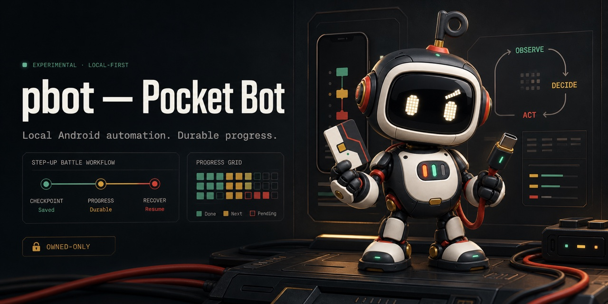

# pbot — Pocket Bot

[](https://github.com/dion-labs/pbot/actions/workflows/ci.yml)
[](LICENSE)
[](#project-status)
[](SECURITY.md)
[](https://github.com/sponsors/dion-labs)



pbot is an experimental local automation workbench for Pokémon TCG Pocket Step-Up Battles. It observes the game through screenshots and OCR, controls an authorized Android device with human-like ADB input, records progress in SQLite, and exposes a local dashboard for setup, live progress, and intervention.

It was built for one real account and one reference device as a DionLabs example of agent-built personal software. It is useful, inspectable, and tested on that setup; it is not a universal or turnkey bot. If your hardware, screen layout, collection, or game version differs, expect to adapt it—ideally with a coding agent and the included [porting guide](docs/AGENT_PORTING.md).

> [!IMPORTANT]
> pbot is an unofficial fan project and is not affiliated with, endorsed by, or sponsored by The Pokémon Company, Creatures Inc., DeNA, Nintendo, or their affiliates. Pokémon and related marks belong to their respective owners. Automation may violate a game's rules or terms and may put an account at risk. Review the applicable rules and use pbot only on accounts and devices you control, at your own risk.

There is no hosted demo or public control plane. The unauthenticated dashboard and API are intentionally loopback-only and must not be exposed to a LAN or the internet.

## What it does

- Discovers incomplete Step-Up Battle frontiers and persists the result.
- Runs guarded auto battles with owned decks and records wins, missions, losses, ties, recommendations, and evidence.
- Chooses verified owned counters, falls back to untried decks with proven local auto-battle wins, then optionally builds a known recipe in a guarded pbot-managed slot.
- Recovers from restarts and USB disconnects at durable checkpoints.
- Stops with `needs_attention` and evidence when it cannot choose a policy-safe action.
- Shows run state, progress, events, queue state, and a live device view in a local dashboard.

The current autonomous milestone focuses on first wins. Complete mission planning and end-to-end manual battle play remain future work; see [One-button autonomous operation](docs/AUTONOMOUS_RUN.md).

## Verified reference setup

pbot is currently verified on:

- an Apple Silicon Mac running macOS;
- Node.js 22.13 or newer and Python 3.11 or newer through `uv`;
- Android Platform Tools (`adb`);
- a Samsung Android phone connected over USB with USB debugging enabled;
- Apple Vision OCR, compiled locally with the macOS Swift toolchain;
- one existing Pokémon TCG Pocket account and its owned card collection.

An Android emulator may work but is not part of the release proof. Other Android devices, resolutions, OCR providers, collections, and future Pocket layouts may require code or calibration changes.

## Safety contract

- Screen capture and human-like taps/swipes only—no process injection, memory inspection, traffic interception, or anti-cheat bypasses.
- Owned cards and owned decks only by default; no rental decks.
- No purchases, crafting, pack points, premium currency, or resource spending.
- Login and secure device unlock are human handoffs; credentials are never stored.
- Navigation and deck actions use visible read-back checks and fail closed on an unrecognized state.
- Runtime screenshots, account data, device identifiers, and progress stay under ignored local runtime storage.

The spending lock is a policy guard implemented by pbot, not an Android security boundary. Keep the API and dashboard on localhost, supervise the first run, and do not use an account you cannot afford to lose.

## Install

[Download the v0.1.5 source release](https://github.com/dion-labs/pbot/releases/tag/v0.1.5), extract it, and run the following commands from its project directory. Release assets include a SHA-256 checksum file.

Install the Xcode Command Line Tools, Node.js, `uv`, and Android Platform Tools first. Then:

```bash
uv sync --frozen
npm ci
cp .env.example .env.local
```

pbot checks Android Studio's standard macOS SDK location automatically. If ADB is elsewhere, set `PBOT_ADB` in `.env.local` to its absolute path. Never commit that local file.

## First run

1. Connect the Android phone, enable USB debugging, and accept the RSA authorization prompt.
2. Start pbot:

   ```bash
   npm run dev
   ```

3. Open the dashboard URL printed in the terminal. The control API binds to `127.0.0.1:8765`; the dashboard uses the first available port starting at `3000`.
4. Complete game login or secure unlock manually if requested.
5. Press **Scan account**, then **Scan recipe cards**. These read-only scans establish which numbered decks and shipped recipe cards the account can actually use.
6. Review the safety status and press **Run pbot**.

Scan evidence must match the selected device. Rerun both scans after switching game accounts; a device identifier alone does not identify which account is logged in.

The autonomous worker runs as a detached, durable job. The dashboard can be closed and reopened without losing SQLite progress. Pause or Stop when disconnecting the device.

To diagnose the Android bridge before opening the dashboard:

```bash
uv run pbot doctor
```

To keep a powered device awake during long runs:

```bash
uv run python scripts/configure_device_awake.py enable --serial YOUR_ADB_SERIAL
```

The original device settings are saved under ignored `var/` storage and can be restored by replacing `enable` with `restore`. A secure PIN or password still requires manual entry after a reboot or reconnect.

## Scripted controls

The dashboard is the primary interface. These commands are useful for development and recovery:

```bash
# Read-only account and card preflight
uv run python scripts/scan_account.py --serial YOUR_ADB_SERIAL
uv run python scripts/scan_cards.py --serial YOUR_ADB_SERIAL

# Verify or construct the configured pbot-managed deck
uv run python scripts/build_managed_deck.py --serial YOUR_ADB_SERIAL

# Start, inspect, or stop a durable autonomous job
uv run python scripts/pbot_job.py start --autonomous --serial YOUR_ADB_SERIAL
uv run python scripts/pbot_job.py status
uv run python scripts/pbot_job.py logs --lines 30
uv run python scripts/pbot_job.py stop
```

Only one managed queue job can be active. `stop` terminates its process group and recovers interrupted work claims before returning.

## Adapting pbot

Start with [Agent-assisted porting](docs/AGENT_PORTING.md). It maps the device, OCR, coordinate, classifier, deck, and strategy seams; lists invariants an agent must preserve; and gives an evidence-first workflow for adapting pbot without weakening its guards.

Local or remote models are not required by the current deterministic first-win path. Future model-backed interpretation or research should be explicit, replaceable, schema-constrained, and subordinate to the same ownership and spending validators.

## Development

Run the complete local verification suite:

```bash
npm run lint
npm test
```

`npm test` builds and server-renders the dashboard, runs its HTML smoke test, and executes the Python harness tests. The separate [opt-in process lifecycle acceptance harness](docs/PROCESS_LIFECYCLE_ACCEPTANCE.md) tests actual disposable process trees, interruption and cleanup without using a device. Runtime data in `var/`, local environment files, screenshots, device identifiers, and the private development journal must never be committed.

The opt-in [local browser acceptance harness](docs/BROWSER_ACCEPTANCE.md) checks the actual dashboard and HTTP API with temporary fictional data and fake dispatch. It includes narrow-screen layout, keyboard/error/retry behavior and Origin rejection; physical device/account acceptance remains separate.

## Project status

pbot is experimental software under active development. Version `0.1.5` documents the first public reference workflow: it is real, durable, and guarded on the verified setup, but game UI changes can break visual automation without warning. Unsupported states intentionally stop with evidence instead of guessing.

See the [changelog](CHANGELOG.md), [contributing guide](CONTRIBUTING.md), [security policy](SECURITY.md), and [brand assets](docs/brand/README.md). Questions about adapting a device or layout should begin with the [agent-assisted porting guide](docs/AGENT_PORTING.md).

Released under the [MIT License](LICENSE). If pbot is useful to your own experiments, you can [sponsor Dion Labs](https://github.com/sponsors/dion-labs).

